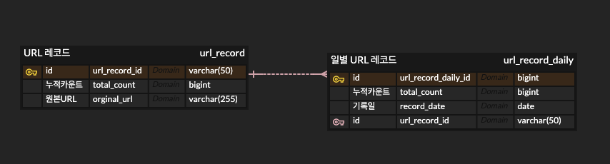

# URL 트래킹 서비스

## 개요

- URL 트랙킹 사이트를 바탕으로 URL 트래킹 기능을 클론하는 프로젝트입니다.
    - 얼마나 많은 사람이 해당 URL 을 클릭했는지를 통계로 확인할 수 있습니다.

## 실행환경

- JAVA17
- Spring Boot 3.X
- DOCKER

## 실행방법

- 프로젝트 최상위 경로에서 `docker-compose up` 명령어를 통해 실행합니다.
- docker 실행 후 `./gradlew clean`, `./gradlew bootRun` 명령어를 통해 실행할 수 있습니다.

## 사용방법

- URL 저장

```agsl
curl --location --request POST 'localhost:8080/api/v1/url' \
--header 'Content-Type: application/json' \
--data-raw '{
    "url": "http://www.naver.com"
}'
```

- 누적 조회수 조회

```agsl
curl --location --request POST 'localhost:8080/api/v1/url/counts' \
--header 'Content-Type: application/json' \
--data-raw '{
    "url": "http://www.naver.com"
}'
```

- 일주일간 조회수 조회

```agsl
curl --location --request POST 'localhost:8080/api/v1/url/statistic' \
--header 'Content-Type: application/json' \
--data-raw '{
    "url": "http://www.google.com"
}'
```

## API 문서

`http://localhost:8080/swagger-ui/index.html`

## 기능

- [x] URL 의 카운트를 증가하는 api 호출시 일간 조회수 및 누적 조회수 1 증가
- [x] URL 의 카운트를 조회하는 api 호출시 오늘 카운트와 누적 카운트를 응답
- [x] 하루가 지나면 일간 조회수 초기화
- [X] 해당 url의 통계를 조회할 수 있고 해당 데이터는 최근 7일간의 일간 조회수 응답

## ERD




